# Advanced Lane Finding

### With the driving video as an input, the goal is to effectively identify lane boundaries and present numerical estimation of lane curvature and vehicle position.

#### Final Videos

| |  |
|:---:|:---:|
|[Challenge_video - Youtube](https://youtu.be/4ly1T2cCRLU)|[Project Video (easy one) - Youtube](https://youtu.be/33gyWJF9V1k) |

---

The steps to execute this project are the following:

* Compute the camera calibration matrix and distortion coefficients given a set of chessboard images.
* Apply a distortion correction to raw images.
* Use color transforms, gradients, etc., to create a thresholded binary image.
* Apply a perspective transform to rectify binary image ("birds-eye view").
* Detect lane pixels and fit to find the lane boundary.
* Determine the curvature of the lane and vehicle position with respect to center.
* Warp the detected lane boundaries back onto the original image.
* Output visual display of the lane boundaries and numerical estimation of lane curvature and vehicle position.

---

## Camera Calibration

A chessboard is used to do the camera calibration, because its regular high contrast pattern makes it easy to detect shape automatically.

| Original image | Undistorted image |
|:---:|:---:|
| |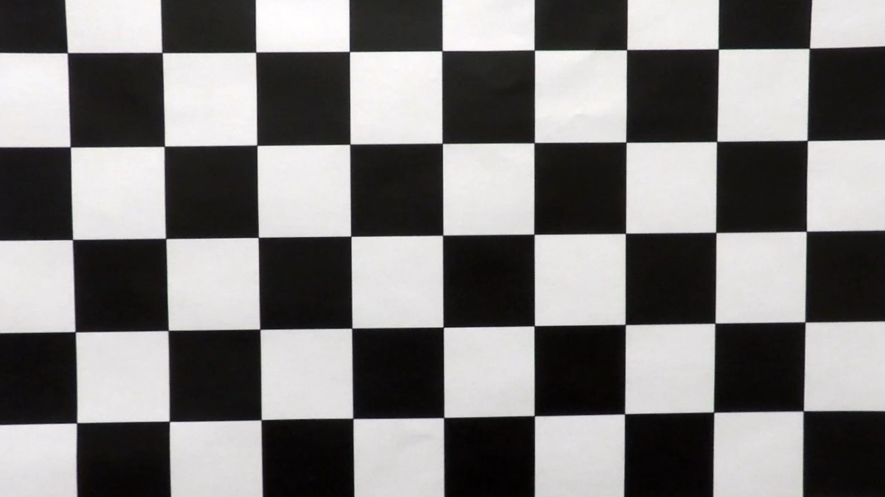|

First, a chessboard image is converted to a grayscale image. Then the OpenCV function `findChessboardCorners()` and `drawChessboardCorners()` can automatically find and draw internal corners in an image of a chessboard pattern. These internal corners of the chessboard along with their pixel ocations are fed into `cv2.calibrateCamera()`, which returns camera calibration and distortion coefficients. These can then be used as input parameters to the `cv2.undistort()` function to undo the effects of distortion on any image produced by the same camera.

##### More examples

|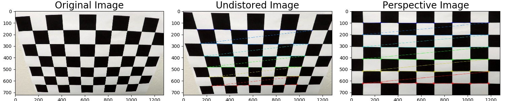|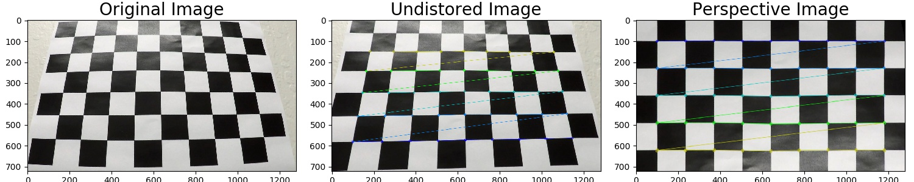|
|---|---|
|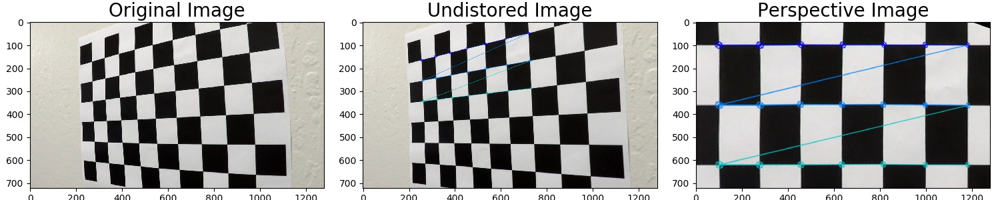|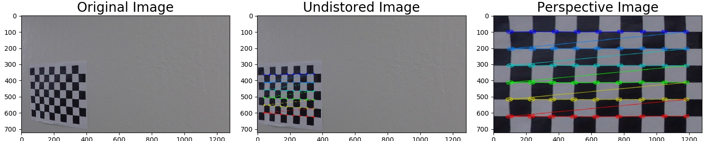|

## Pipeline (single images)

### 1, Image distortion correction

With the assumption that the distortion coefficients from the same camera are consistent, I used the same calibration parameters to undistort the images during driving. The image perspective transformation code is in [perspective_transform_utils.py](https://github.com/garygangwu/advanced_lane_finding/blob/master/perspective_transform_utils.py)

| Original image | Undistorted image |
|:---:|:---:|
|||

### 2. Color and gradients transforms

This is one of most tedious steps, as I have to explore various threasholds and tranform combinations and then evaluate the results. In the end, I only used HLS and HSV color transformation to detect yellow and white lanes.

#### Color transform steps

| Step | Method | Threshold | Result |
|:---|:---|:---|:---|
| 1 | Convert the image to HLS color space, and extract yellow color | Yellow: ([20,120,30], [40,255,255]) ||
| 2 | Convert the image to HSV color space, and extract white color | White: ([0,0,200], [255,30,255]) |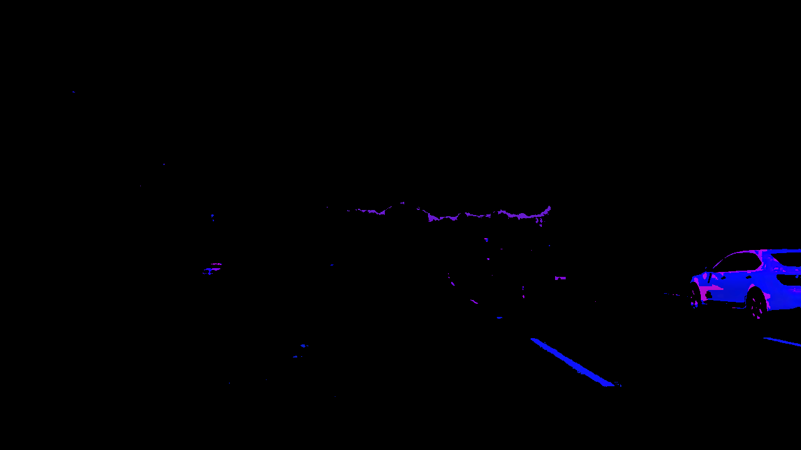|
| 3 | Convert HLS/HSV results to grayscale and then merge them | Grayscale: (20, 255) |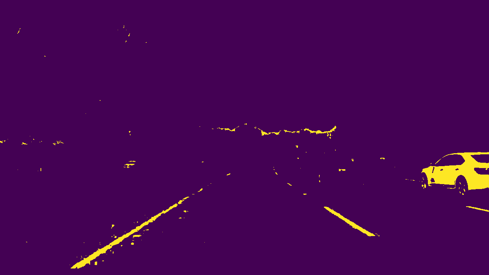|

To speed up my evaluations, I developed a set of color and gradients transform utility functions in [image_transform_utils.py](https://github.com/garygangwu/advanced_lane_finding/blob/master/image_transform_utils.py) to find proper thresholds and tranform combination to detect lanes while minimzing the road noises due to the shadows, road cracks, and pavement changes.

#### Examples of color and gradients transform results that have been evaluated but abandoned

| RGB (color filtered) |Soblex (with threshold) | Mag (with threshold) | Dir (with threshold)|
|:---:|:---:|:---:|:---:|
|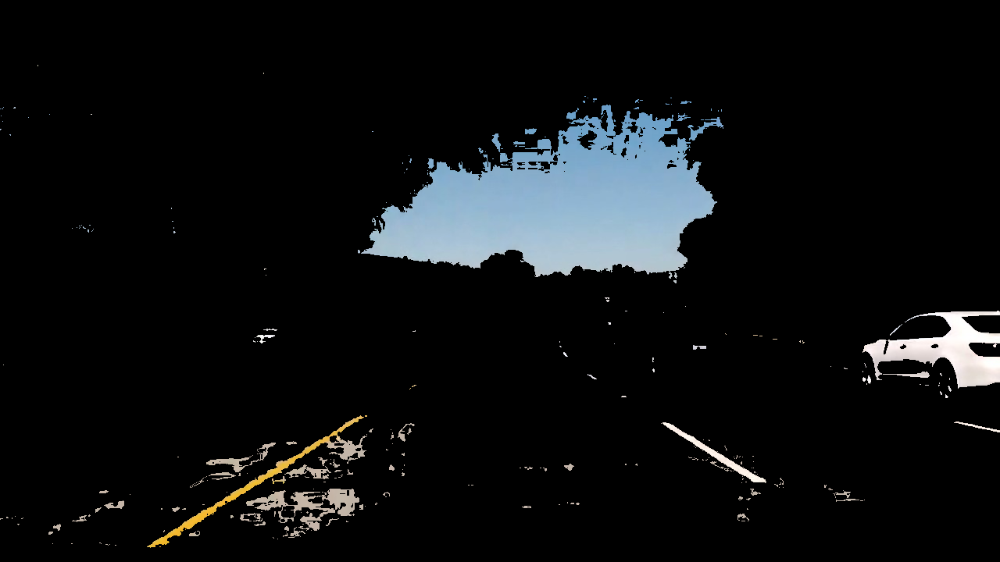|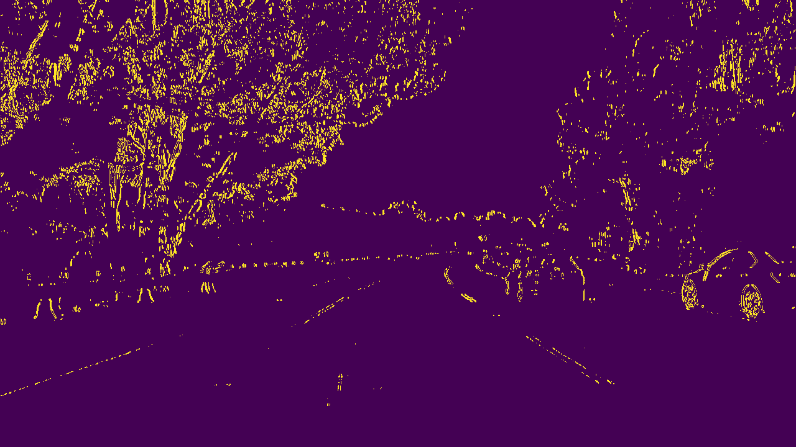|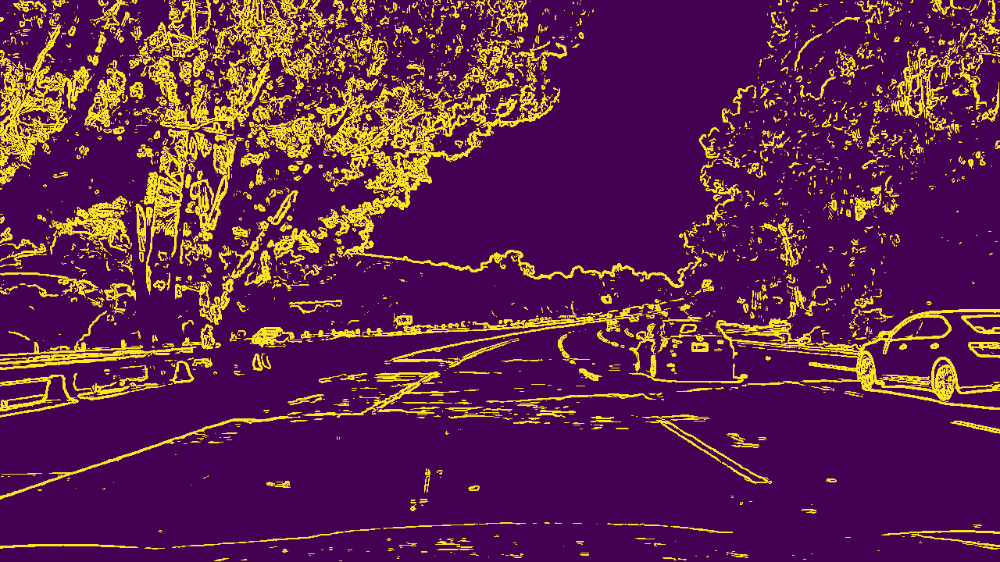|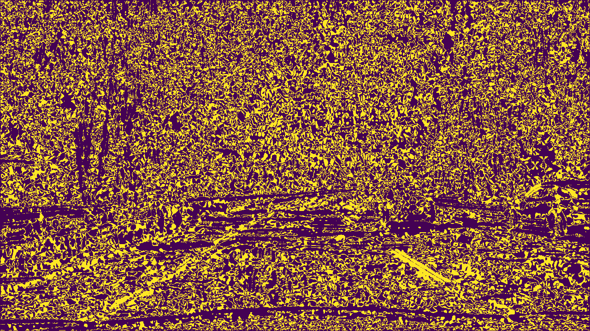|

### 3. Perspective transform

The code for my perspective transform is inside [perspective_transform_utils.py](https://github.com/garygangwu/advanced_lane_finding/blob/master/perspective_transform_utils.py) with the source and destination points selected as below. These points are evaluated empirically to ensure the lanes are well covered from a bird view

| Source        | Destination   | 
|:-------------:|:-------------:| 
| 550, 477      | 320, 0        | 
| 160, 720      | 320, 720      |
| 1120, 720     | 960, 720      |
| 730, 477      | 960, 0        |

| Undistorted image | Warped Image | Warped Binary |
|:---:|:---:|:---:|
|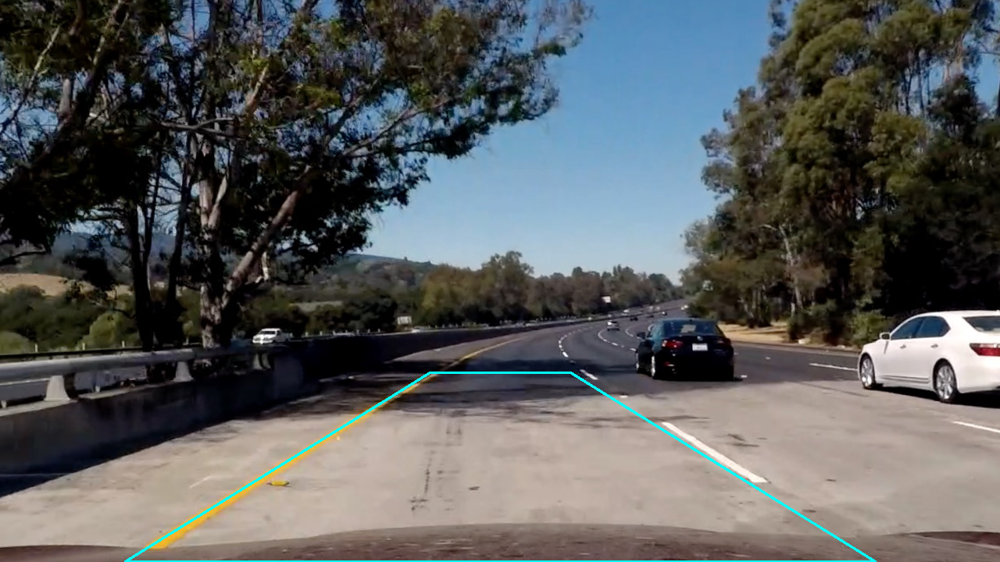||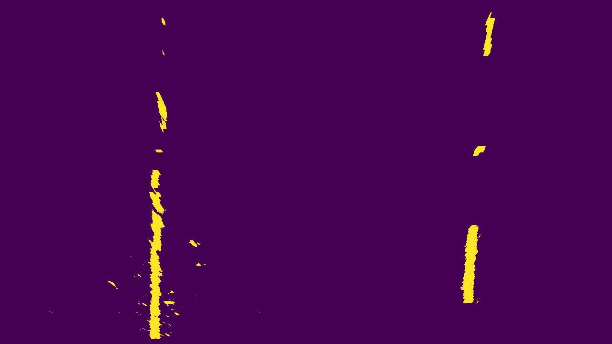|

### 4. Identify lane-line pixels and match their positions with a polynomial

| Draw the polynomials | Highligh the lane | Perspective transform back |
|:---:|:---:|:---:|
|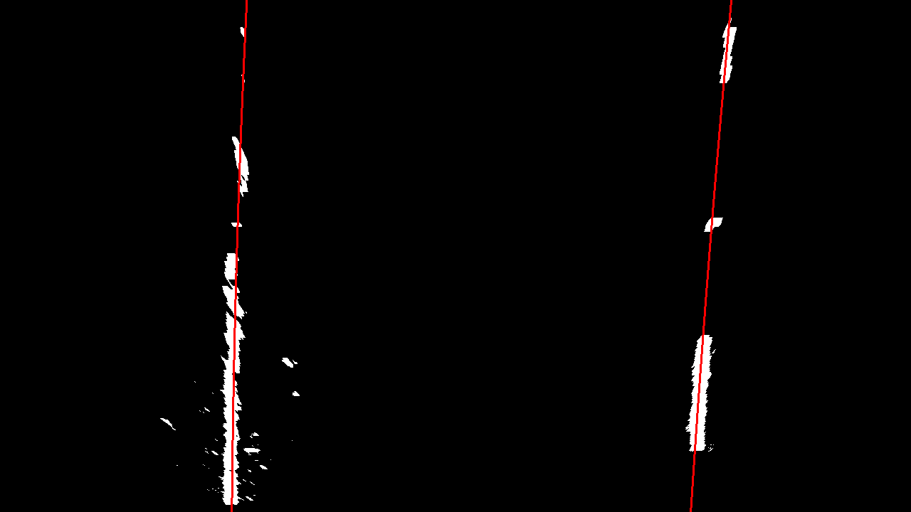|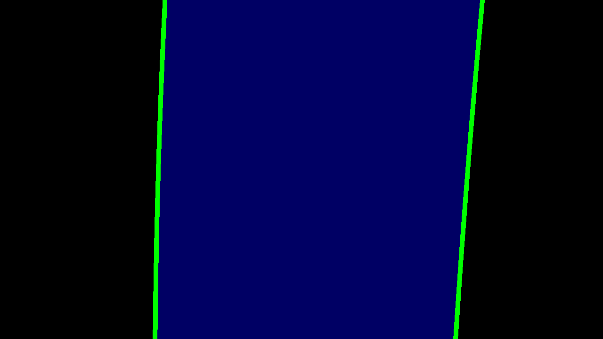|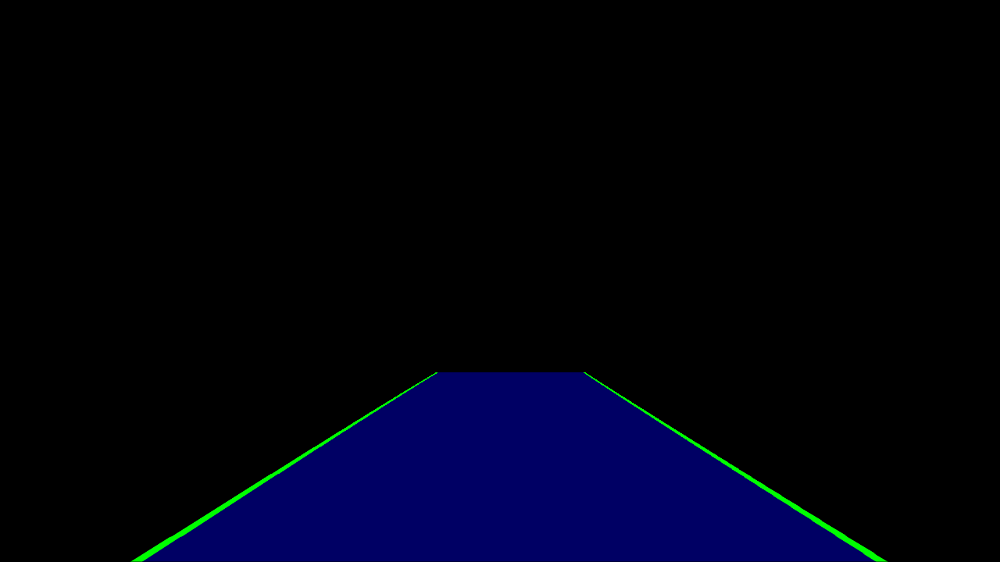|

### 5. Calculated the radius of curvature of the lane and the position of the vehicle with respect to center

### 6. Plot the results back to front-facing image

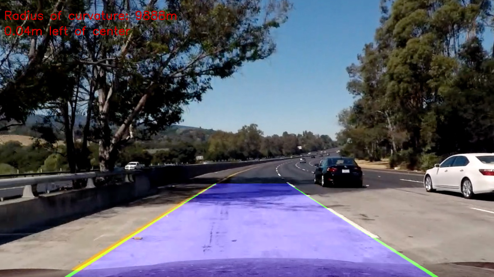

## Files and usage
* `camera_calibration_utils.py`: utility functions to do the camera calibration from the chessboard images
