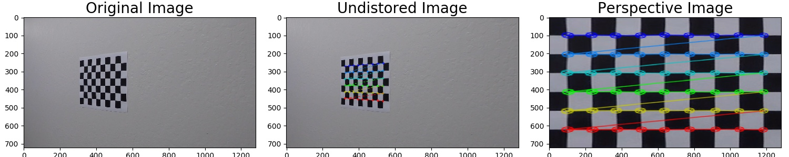

# Advanced Lane Finding

### With the driving video as an input, the goal is to effectively identify lane boundaries and present numerical estimation of lane curvature and vehicle position.

Youtube Videos

---

The steps to execute this project are the following:

* Compute the camera calibration matrix and distortion coefficients given a set of chessboard images.
* Apply a distortion correction to raw images.
* Use color transforms, gradients, etc., to create a thresholded binary image.
* Apply a perspective transform to rectify binary image ("birds-eye view").
* Detect lane pixels and fit to find the lane boundary.
* Determine the curvature of the lane and vehicle position with respect to center.
* Warp the detected lane boundaries back onto the original image.
* Output visual display of the lane boundaries and numerical estimation of lane curvature and vehicle position.

---

## Camera Calibration

A chessboard is used to do the camera calibration, because its regular high contrast pattern makes it easy to detect shape automatically.

| Original image | Undistorted image |
|:---:|:---:|
| ||

First, a chessboard image is converted to a grayscale image. Then the OpenCV function `findChessboardCorners()` and `drawChessboardCorners()` can automatically find and draw internal corners in an image of a chessboard pattern. These internal corners of the chessboard along with their pixel ocations are fed into `cv2.calibrateCamera()`, which returns camera calibration and distortion coefficients. These can then be used as input parameters to the `cv2.undistort()` function to undo the effects of distortion on any image produced by the same camera.

##### More examples

|||
|---|---|
|||
|||
|||
|||
|||

## Files and usage
* `camera_calibration_utils.py`: utility functions to do the camera calibration from the chessboard images
