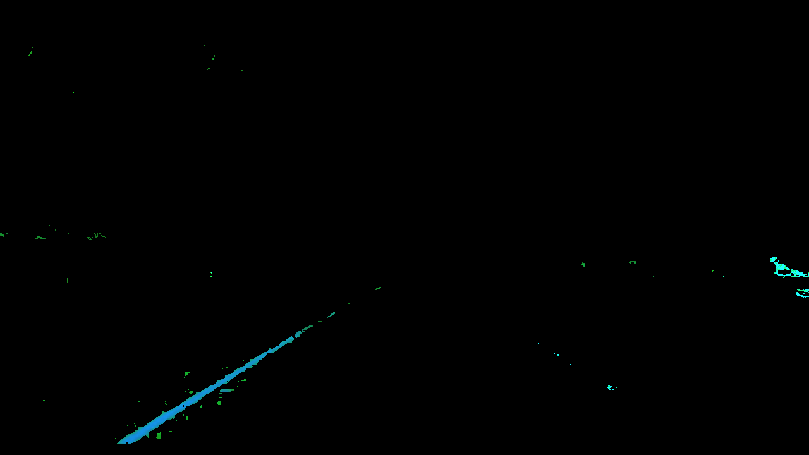
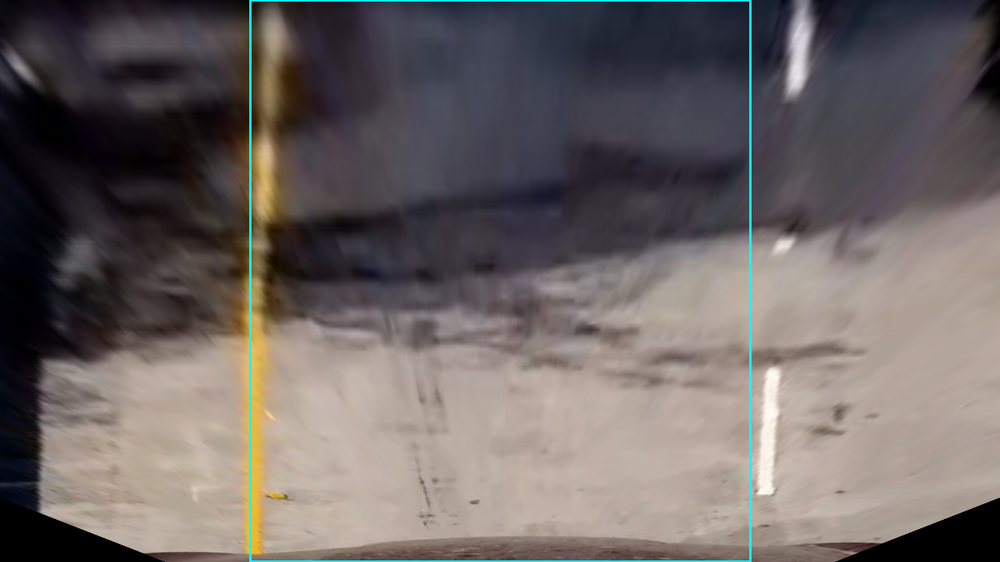
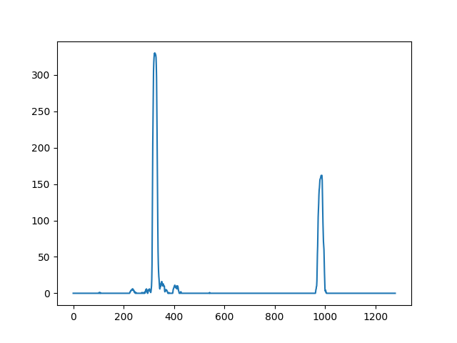
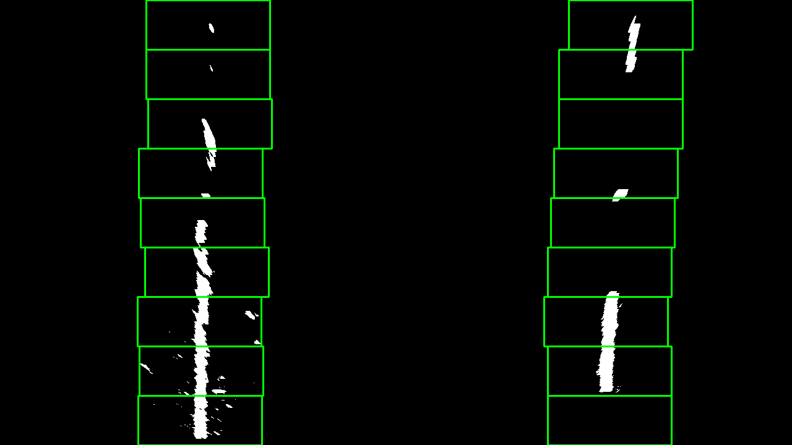

# Advanced Lane Finding
[](http://www.udacity.com/drive)

### With the driving video as an input, the goal is to effectively identify lane boundaries and present numerical estimation of lane curvature and vehicle position.

#### Final Videos

|<a href="http://www.youtube.com/watch?feature=player_embedded&v=4ly1T2cCRLU" target="_blank"></a> | <a href="http://www.youtube.com/watch?feature=player_embedded&v=33gyWJF9V1k" target="_blank"></a> |
|:---:|:---:|
|[Challenge_video - Youtube](https://youtu.be/4ly1T2cCRLU)|[Project Video (easy one) - Youtube](https://youtu.be/33gyWJF9V1k) |

---

The steps to execute this project are the following:

* Compute the camera calibration matrix and distortion coefficients given a set of chessboard images.
* Apply a distortion correction to raw images.
* Use color transforms, gradients, etc., to create a thresholded binary image.
* Apply a perspective transform to rectify binary image ("birds-eye view").
* Detect lane pixels and fit to find the lane boundary.
* Determine the curvature of the lane and vehicle position with respect to center.
* Warp the detected lane boundaries back onto the original image.
* Output visual display of the lane boundaries and numerical estimation of lane curvature and vehicle position.

---

## Camera Calibration

A chessboard is used to do the camera calibration, because its regular high contrast pattern makes it easy to detect shape automatically.

| Original image | Undistorted image |
|:---:|:---:|
| ||

First, a chessboard image is converted to a grayscale image. Then the OpenCV function `findChessboardCorners()` and `drawChessboardCorners()` can automatically find and draw internal corners in an image of a chessboard pattern. These internal corners of the chessboard along with their pixel ocations are fed into `cv2.calibrateCamera()`, which returns camera calibration and distortion coefficients. These can then be used as input parameters to the `cv2.undistort()` function to undo the effects of distortion on any image produced by the same camera.

##### More examples

|||
|---|---|
|||

---

## Pipeline (single images)

### 1, Image distortion correction

With the assumption that the distortion coefficients from the same camera are consistent, I used the same calibration parameters to undistort the images during driving. The image perspective transformation code is in [perspective_transform_utils.py](https://github.com/garygangwu/advanced_lane_finding/blob/master/perspective_transform_utils.py)

| Original image | Undistorted image |
|:---:|:---:|
|||

### 2. Color and gradients transforms

This is one of most tedious steps, as I have to explore various threasholds and tranform combinations and then evaluate the results. In the end, I only used HLS and HSV color transformation to detect yellow and white lanes.

#### Color transform steps

| Step | Method | Threshold | Result |
|:---|:---|:---|:---|
| 1 | Convert the image to HLS color space, and extract yellow color | Yellow: ([20,120,30], [40,255,255]) ||
| 2 | Convert the image to HSV color space, and extract white color | White: ([0,0,200], [255,30,255]) ||
| 3 | Convert HLS/HSV results to grayscale and then merge them | Grayscale: (20, 255) ||

To speed up my evaluations, I developed a set of color and gradients transform utility functions in [image_transform_utils.py](https://github.com/garygangwu/advanced_lane_finding/blob/master/image_transform_utils.py) to find proper thresholds and tranform combination to detect lanes while minimzing the road noises due to the shadows, road cracks, and pavement changes.

#### Examples of color and gradients transform results that have been evaluated but abandoned

| RGB (color filtered) |Soblex (with threshold) | Mag (with threshold) | Dir (with threshold)|
|:---:|:---:|:---:|:---:|
|||||

### 3. Perspective transform

The code for my perspective transform is inside [perspective_transform_utils.py](https://github.com/garygangwu/advanced_lane_finding/blob/master/perspective_transform_utils.py) with the source and destination points selected as below. These points are evaluated empirically to ensure the lanes are well covered from a bird view

| Source        | Destination   | 
|:-------------:|:-------------:| 
| 550, 477      | 320, 0        | 
| 160, 720      | 320, 720      |
| 1120, 720     | 960, 720      |
| 730, 477      | 960, 0        |


| Undistorted image | Warped Image | Warped Binary |
|:---:|:---:|:---:|
||||

### 4. Locate the Lane Lines and Fit a Polynomial

With a binary image, the next step is to explicitly determine which pixels belong to the left and right line. A histogram along all the columns in the lower half of the image is drawed below. The two most prominent peaks in this histogram will be good indicators of the x-position of the base of the lane lines. This is a starting point for where to search for the lines. From that point, a sliding window is placed around the line centers and the next window can follow the pixel density curve up to the top of the frame.

| pixel histogram of the bottom half of the image | Sliding windows to capture lane pixels |
|:---:|:---:|
|||

After all the points captured in the left side sliding windows and the right side sliding windows, I can fit a second order polynomial to each line.

```
left_fit = np.polyfit(lefty, leftx, 2)
right_fit = np.polyfit(righty, rightx, 2)
```

| Draw the polynomials | Highlight the lane | Inverse perspective transform |
|:---:|:---:|:---:|
||||

In addition, the sliding window approach only needs to be adopted in the first frame. Since consecutive frames are likely to have lane lines in roughly similar positions, we search around a margin of 100 pixels of the previously detected lane lines.

The related code can be found in [lane_line.py](https://github.com/garygangwu/advanced_lane_finding/blob/master/lane_line.py)


### 5. Calculated the radius of curvature of the lane and the position of the vehicle with respect to center

The radius of curvature is based on pixel values, which is not the same as real world space. Therefore we need to translate them back to the real word measurement standard.  

```
ym_per_pix = 30./720 # meters per pixel in y dimension
xm_per_pix = 3.7/700 # meteres per pixel in x dimension
left_fit_cr = np.polyfit(lefty*ym_per_pix, leftx*xm_per_pix, 2)
right_fit_cr = np.polyfit(righty*ym_per_pix, rightx*xm_per_pix, 2)
left_curverad = ((1 + (2*left_fit_cr[0]*np.max(lefty) + left_fit_cr[1])**2)**1.5) \
                             /np.absolute(2*left_fit_cr[0])
right_curverad = ((1 + (2*right_fit_cr[0]*np.max(lefty) + right_fit_cr[1])**2)**1.5) \
                                /np.absolute(2*right_fit_cr[0])
```

Assume the camera position in the center middle of the car, the middle of the image maps to the car center. The deviation can be calculated as the difference between the center of picture and the center of the lane

```
center_lane = (right_startx + left_startx) / 2
center_car = image.shape[1] / 2
deviation = abs(center_lane - center_car) * xm_per_pix
```

### 6. Plot the results back to front-facing image

Finally, we can overlay the detected lane image along with curvature and vehicle postion onto the undistorted frame.


The code of the main pipeline can be found in [finding_lanes.py](https://github.com/garygangwu/advanced_lane_finding/blob/master/finding_lanes.py)

---

## Files and usage
* `camera_calibration_utils.py`: utility functions to do the camera calibration from the chessboard images
